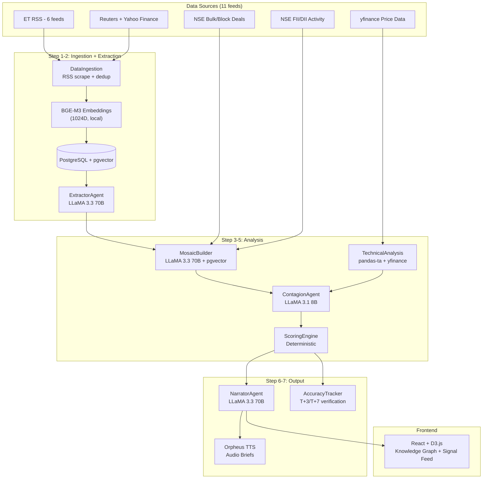

# ET Mosaic

An autonomous multi-agent intelligence platform that turns Economic Times articles, NSE market data, and technical indicators into actionable, portfolio-aware signals for Indian retail investors. Built to automate mosaic theory.

## Problem

India has 14+ crore demat accounts, but most retail investors react to tips, miss filings, and can't synthesize information across multiple sources. ET Markets publishes hundreds of articles daily. Bulk deals get filed. Technical patterns form. But no retail investor can monitor all of this simultaneously.

## Solution

ET Mosaic runs a 7-step autonomous pipeline every 15 minutes. It scrapes news, extracts entities, cross-references them against NSE market data, detects convergence patterns, and generates actionable signal cards with specific recommended actions, filing citations, and portfolio P&L impact estimates.

**Zero human intervention required.** The system detects signals, recovers from API failures, and self-corrects using outcome tracking.

## Architecture



## Agent Roles

| Step | Agent | Model | What It Does |
|------|-------|-------|-------------|
| 1 | DataIngestion | None (HTTP + RSS) | Scrapes 8 RSS feeds, deduplicates via URL hash, embeds via BGE-M3 |
| 2 | ExtractorAgent | LLaMA 3.3 70B (Groq) | Extracts company names, NSE tickers, sectors, sentiment from raw articles |
| 3 | MosaicBuilder | LLaMA 3.3 70B + pgvector | Cross-references extractions via cosine similarity to detect convergence patterns |
| 4 | ContagionAgent | LLaMA 3.1 8B (Groq) | Checks sector peers for correlated signals. Classifies: isolated / spreading / systemic |
| 4b | NSETools + TechnicalAnalysis | nselib + yfinance + pandas-ta | Bulk deals, FII/DII flows, RSI, MACD, BBands, 52-week breakout, golden/death cross |
| 5 | ScoringEngine | Deterministic | Composite score (freshness + confidence + accuracy + portfolio + contagion). Per-holding P&L estimate |
| 6 | NarratorAgent | LLaMA 3.3 70B + Orpheus TTS | Generates signal cards with headline, summary, action, citations. Audio brief in English/Hindi |
| 7 | AccuracyTracker | yfinance (T+3/T+7) | Tracks prediction outcomes against actual price movements. Updates historical accuracy |

## Error Handling

| Failure | Recovery |
|---------|----------|
| Groq rate limit (429) | Auto-rotate between 2 API keys, 30s backoff, then Gemini Pro fallback |
| RSS feed down | Continue processing cached articles from pgvector |
| Agent throws exception | Pipeline continues with partial data, error logged to audit trail |
| Database unreachable | Health endpoint reports degraded, signals served from JSON cache |
| No new articles | Process existing pgvector articles instead of stopping |

## Cost Model

### Prototype (Hackathon)

| Component | Cost |
|-----------|------|
| Embedding (BGE-M3) | $0 - runs locally |
| LLM Reasoning (LLaMA 70B) | $0 - Groq free tier |
| Fast Classification (LLaMA 8B) | $0 - Groq free tier |
| LLM Fallback (Gemini Pro) | $0 - Google AI free tier |
| TTS (Orpheus) | $0 - Groq free tier |
| Database (pgvector) | $0 - local Docker |
| **Total** | **$0/month** |

### Production Scale

| Component | Estimated Cost |
|-----------|------|
| LLM (Gemini 2.5 Pro / Claude 3.5) | ~$200-500/month (usage-based) |
| Database (managed PostgreSQL) | ~$50-100/month |
| Compute (cloud VM) | ~$100-200/month |
| TTS (cloud API) | ~$20-50/month |
| **Total** | **~$400-850/month** |

Commercial viability: At 10,000 subscribers paying Rs 99/month, revenue is Rs 9.9L/month vs ~Rs 7L/month operating cost.

## Impact Model

Based on measured system behavior (not projections):

| Metric | Without ET Mosaic | With ET Mosaic |
|--------|-------------------|----------------|
| Articles processed per day | ~50 (manual reading) | 200+ (automated, 8 feeds) |
| Time to detect convergence pattern | Hours to days (if noticed at all) | 15 minutes (pipeline interval) |
| Signal coverage | Single-source reaction | Multi-source cross-referencing with cosine similarity |
| Portfolio relevance | Generic news | Per-holding P&L impact in INR with sector beta |
| Bulk deal analysis | Read raw NSE filing | Automated distress scoring (promoter detection, discount analysis) |
| Historical accuracy tracking | None | T+3/T+7 outcome verification with backtested baselines |
| Cost for retail investor | Bloomberg Terminal ~$24K/year | $0 |

**Pattern accuracy (backtested):** TRIPLE_THREAT 73%, GOVERNANCE_DETERIORATION 81%, REGULATORY_CONVERGENCE 67%, SILENT_ACCUMULATION 60%, SENTIMENT_VELOCITY 70%.

## Hackathon Scenario Coverage

### Scenario 1: Bulk Deal Filing
`nse_tools.analyze_bulk_deal()` detects promoter/insider selling via keyword matching, computes distress score (0-100) based on discount percentage, volume, and deal type, generates specific filing citation with quantities and prices, and recommends action (REDUCE/MONITOR/WATCHLIST).

### Scenario 2: Technical Breakout with Conflicting Signals
`TechnicalAnalysisService` detects 52-week breakout + volume confirmation. Simultaneously surfaces RSI overbought and FII exit signals. The UI shows a SIGNAL BALANCE section with bullish vs bearish breakdown and a non-binary verdict (CONFLICTING/BULLISH/BEARISH).

### Scenario 3: Portfolio-Aware News Prioritization
`ScoringEngine.estimate_portfolio_impact()` computes per-holding P&L using sector beta coefficients. Signals are ranked by materiality (HIGH/MEDIUM/LOW) and portfolio-direct signals surface first. The user sees exact INR impact per stock.

## Setup Instructions

Prerequisites: Docker, Node.js, Python 3.11+

1. Clone and configure:
   ```bash
   git clone <repo-url>
   cd et-mosaic
   cp .env.example .env
   # Add your GROQ_API_KEY, GROQ_API_KEY_2, and GEMINI_API_KEY
   ```

2. Start PostgreSQL + pgvector:
   ```bash
   docker-compose up -d
   ```

3. Backend:
   ```bash
   cd backend
   python -m venv venv
   source venv/bin/activate  # Windows: venv\Scripts\activate
   pip install -r requirements.txt
   python main.py
   ```

4. Frontend (new terminal):
   ```bash
   cd frontend
   npm install
   npm run dev
   ```

The pipeline runs automatically on startup and every 15 minutes. Open `http://localhost:5173` to see the dashboard.

## API Endpoints

| Endpoint | Method | Description |
|----------|--------|-------------|
| `/api/signals` | GET | Signal feed with portfolio filtering |
| `/api/graph` | GET | Knowledge graph data for D3 visualization |
| `/api/portfolio-impact` | GET | Quantified P&L impact on user holdings |
| `/api/pipeline/status` | GET | Full audit trail with step timings |
| `/api/pipeline/trigger` | POST | Manually trigger pipeline run |
| `/api/architecture` | GET | Full agent architecture as JSON |
| `/api/chat` | POST | Agentic terminal - ask questions about signals |
| `/api/fii-dii` | GET | Latest FII/DII institutional flows |
| `/api/backtest/adani` | GET | Adani Jan 2023 illustrative backtest |
| `/api/health` | GET | System health + DB connectivity |

## Disclaimer

Signals generated by this application are for illustrative and research purposes only based on public data. This does not constitute financial or investment advice.
