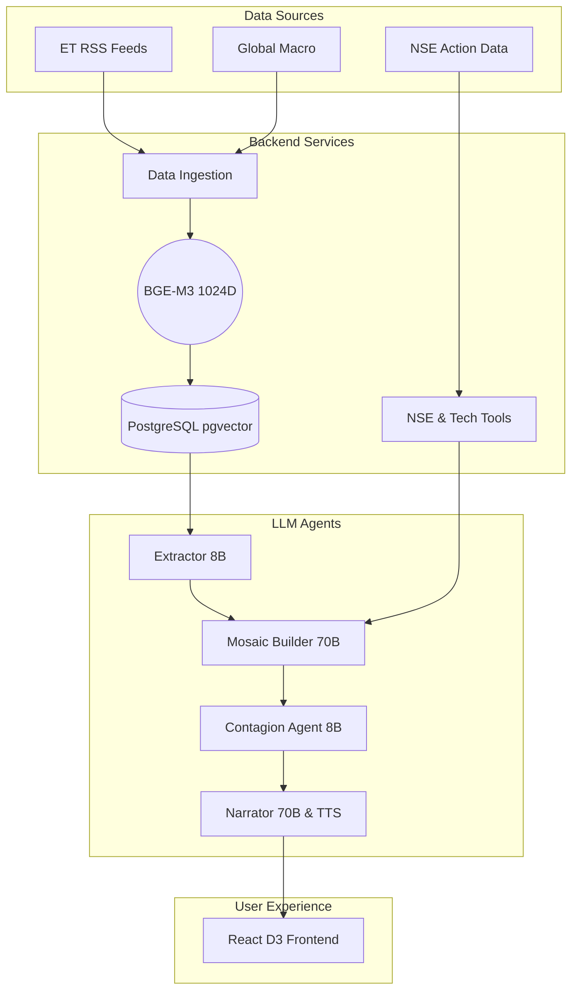

# ET Mosaic

An autonomous quantitative analysis tool that connects public ET news and NSE market data to identify hidden market contagion across the Indian stock market. Built to automate mosaic theory.

## Overview
Instead of reading 500 articles a day, ET Mosaic runs a backend orchestrator every 15 minutes that scrapes news, embeds it using BGE-M3 vectors, and cross-references it against live technical indicators and NSE bulk deals.

It features four LLM-powered agents built on Groq and Gemini, backed by a `pgvector` hybrid search database.

## Architecture



## Setup Instructions

Make sure you have Docker, Node, and Python 3.11+ installed.

1. Clone the repo and enter the directory.
2. Set up your API keys from Groq and Google AI Studio:
   ```bash
   cp .env.example .env
   # Add your GROQ_API_KEY and GEMINI_API_KEY
   ```
3. Boot up the PostgreSQL pgvector database:
   ```bash
   docker-compose up -d
   ```
4. Setup backend and run the API:
   ```bash
   cd backend
   python -m venv venv
   source venv/bin/activate  # or venv\Scripts\activate on Windows
   pip install -r requirements.txt
   python main.py
   ```
5. Setup frontend in a new terminal:
   ```bash
   cd frontend
   npm install
   npm run dev
   ```

## Disclaimer
The insight and signals generated by this application are for illustrative and research purposes only based on public data. This does not constitute financial or investment advice.
